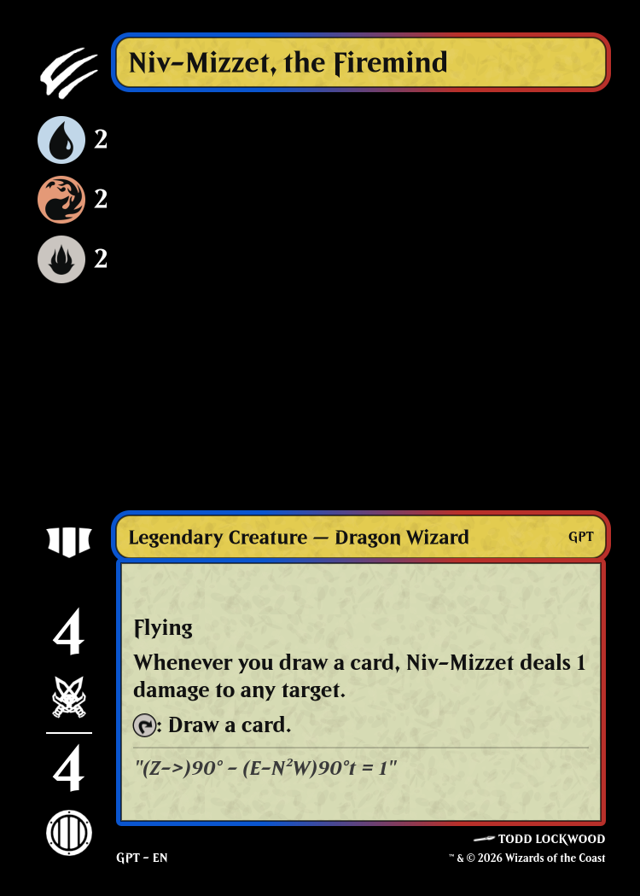

# MTGFannableCards

Turns a Magic: The Gathering decklist into printable cards with the important stats in a black bar down the left edge. When you hold a hand fanned out, only the left edge of each card shows; this layout puts the card type, mana cost, power and toughness (and more) right there.



Cards come out as 750 × 1050 PNG images (63 × 88 mm at 300 DPI), in a zip or as an A4 PDF ready to print and cut. Card data and art come from [Scryfall](https://scryfall.com).

## Reading a card

The bar on the left shows, from top to bottom:

- **Card type icons**, one per type in type-line order (an Artifact Creature shows both).
- **Colour indicator**, for cards that have one: a circle split into one wedge per colour.
- **Mana cost**, grouped: each symbol once, with how many you need. `{2}{U}{U}{R}{R}` reads as blue 2, red 2, generic 2. X is counted the same way.
- **Middle icons**, hanging from the type line: Aura, Equipment and Fortification; Legendary, Basic, Snow and World; non-basic lands; and when the card can be played: Flash (every instant), Split second, and playable from your hand (cycling, suspend, …), the top of your library (miracle) or your graveyard (flashback, …). Lands show the mana their basic land types make.
- **Bottom**: power and toughness (outlined for vehicles and spacecraft), a planeswalker's starting loyalty, a battle's defense, or NON-PERMANENT for instants and sorceries.

The rest of the card is the usual name, art, type line, rules and flavour text, and footer, in the card's colours. Basic lands are full-art.

## Using it

To run your own server with Docker, see the [self-hosting guide](docs/self-hosting.md). To run it from this repository, you need Linux (on Windows, use WSL) and Node.js 22 or later. The first run downloads Scryfall's card data (about 115 MB) into `cache/scryfall/`. After that, each start downloads it again only when Scryfall has published a newer version, and a running server checks once a day. Loading the card data takes about 10 seconds. Art is downloaded as needed and cached in `cache/art/`, so a deck's first run is slower: a 100-card deck takes about 15 seconds with new art, then about 11 seconds once the art is cached.

```
npm install
```

### In the browser

```
npm run web:build
npm start
```

Open http://localhost:3000, paste or type your decklist, and choose **Generate cards**. The card on the line under the cursor is previewed as you type, and names that don't match get clickable suggestions. Choose a zip of PNGs or a PDF, then download it when it's ready. Downloads are kept for an hour.

### From the command line

```
npm run cli -- deck.txt            # out/cards.zip
npm run cli -- deck.txt --pdf      # out/cards.pdf
npm run cli -- deck.txt --png      # out/cards/*.png
npm run cli -- - < deck.txt        # read the decklist from stdin
```

`--out <dir>` writes somewhere other than `out/`. Problems are listed on stderr by line number and never stop the batch; add `--strict` to exit with code 1 when there were any. `--help` lists every option.

### On a DigitalOcean droplet

To put the app on the internet, `npm run provision` sets up a fresh Ubuntu server over SSH. It installs updates, a swap file, Docker and a firewall that only lets SSH and the web through. It also creates a `deploy` user to run the app, and writes the app's Docker setup (see the [self-hosting guide](docs/self-hosting.md)).

1. Create a droplet by following DigitalOcean's guide, [How to Create a Droplet](https://docs.digitalocean.com/products/droplets/how-to/create/). Choose the latest Ubuntu LTS image, the 2 GB / 1 CPU size and the region nearest your players. Under authentication, choose **SSH Key** and add your public key ([How to Add SSH Keys to New or Existing Droplets](https://docs.digitalocean.com/products/droplets/how-to/add-ssh-keys/)).
2. Check you can log in: `ssh root@<droplet IP>`.
3. To use a domain name with HTTPS, add a DNS `A` record that points the name at the droplet's IP.
4. From this repository, run the script with arguments:

   ```
   npm run provision -- --host <droplet IP> --domain cards.example.com --start
   ```

   or with your settings in a JSON file (start from [`scripts/provision.example.json`](scripts/provision.example.json)):

   ```
   cp scripts/provision.example.json provision.json   # then edit it
   npm run provision -- --config provision.json
   ```

   Arguments override the file. `--dry-run` prints what would run on the server without connecting, and `--help` lists every setting. Leave out `--domain` to serve plain HTTP on port 3000. The script is safe to run again, for example to change settings.

5. Open https://cards.example.com. The first start downloads the card data, which takes a minute or so.

The script ends by printing the values that GitHub Actions needs to deploy each push to `main`; the guide's [Continuous deployment](docs/self-hosting.md#continuous-deployment) section explains them.

## Decklist format

One card per line, as exported by Arena, MTGO, Moxfield and most deck builders:

```
Commander
1 Niv-Mizzet, the Firemind

Deck
// Comments go on their own line.
4 Lightning Bolt
4x Counterspell
Delver of Secrets
1 Lightning Bolt (M10)
1 Lightning Bolt (M10) 146
1 Sol Ring [C21] *F*
```

- **Quantities** give that many images: `4 Lightning Bolt` makes four, `4x` works too, and a line with no number is one copy.
- **Names** are matched exactly, ignoring case, extra spaces and curly apostrophes. A double-faced card can be named by either face or by its full `Front // Back` name.
- **Printings**: a set code in brackets, optionally followed by a collector number, chooses the art, set symbol and footer (`(M10) 146`, or `[C21]`). Foil markers such as `*F*` are ignored. Without one, the card's first regular paper printing is used. A printing that can't be found falls back to the default, with a warning.
- **Ignored lines**: blank lines, comments starting with `//` or `#`, and section headers such as Deck, Sideboard, Commander, Companion and Maybeboard. Cards in every section are generated.
- English card names only.

## What you get

- One PNG per copy, named after the card: `Lightning-Bolt.png`, `Lightning-Bolt-2.png`, …
- Double-faced cards give one image per face, front then back, next to each other in the PDF.
- The PDF has nine cards per A4 page at real card size, with thin cut lines.
- A report of anything that went wrong, by line: unreadable lines, names that didn't match (with up to three suggestions), printings that fell back, and cards that were skipped. Every other card is still generated.

Not supported yet: split, flip, adventure and room cards (they are skipped and reported), tokens, emblems, and other languages. The web app takes up to 250 cards per batch.

## Licensing

- **Code**: GPL-3.0 (see `LICENSE`).
- **Fonts**: Beleren 2016 font files from Drake Costa's `@saeris/typeface-beleren-bold` package, MIT licence (`res/fonts/LICENSE.md`). The Beleren typeface is Wizards of the Coast's.
- **Icons**: the project's own symbol sheet and drawn icons (GPL-3.0), icons traced from [magarena](https://github.com/magarena/magarena) (GPL-3.0), and icons from Andrew Gioia's [Mana font](https://github.com/andrewgioia/mana) (SIL Open Font License 1.1). Each file's source is listed in `res/symbols/README.md`.
- **Card data, art and set symbols** are downloaded from Scryfall when you run it; none are included in this repository. Card names, text, art, mana and set symbols are © Wizards of the Coast and their artists.

### Fan Content notice

MTGFannableCards is unofficial Fan Content permitted under the [Fan Content Policy](https://company.wizards.com/en/legal/fancontentpolicy). Not approved/endorsed by Wizards. Portions of the materials used are property of Wizards of the Coast. ©Wizards of the Coast LLC.

The project is free and non-commercial. Generated cards are for personal use and playtesting; don't sell them, or charge for access to them.

## Development

Requires Linux and Node.js 22 or later (see `.nvmrc`). On Windows, use WSL and clone the repository into the Linux filesystem (e.g. `~/MTGFanableCards`), not under `/mnt/c` or `/mnt/d`: node-canvas cannot load the Beleren fonts on native Windows, and `node_modules` must be installed from Linux.

The plan is in `tasks.md` and the full requirements in `Requirements.md`.

```
npm install
npm run check         # lint + format check + tests (what CI runs)
npm test              # tests only (node:test)
npm start             # backend API on http://localhost:3000 (OpenAPI at /api/docs)
npm run web:build     # Build the frontend into web/dist/, served by npm start at http://localhost:3000
npm run web:dev       # Frontend with hot reload on http://localhost:5173 (needs npm start running)
npm run spike:preview # Generate preview images from development spikes
npm run data:download # Download the Scryfall bulk data into cache/scryfall/ (or DATA_DIR)
npm run render:fixtures # Render every fixture with the real renderer into out/render/
npm run cli -- deck.txt  # Generate cards for a decklist into out/cards.zip (--pdf, --png, --strict; --help)
npm run visual:update  # Re-render the visual regression references (test/fixtures/visual/) after an intended change
npm run mockups:compare # Each mockup card beside its render, in out/mockups/
npm run perf          # Time a 100-card deck with a cold and a warm art cache (T-S6)
```

### Folder structure

```
src/
  data/     Dev A: Scryfall bulk data loader, decklist parser, printing selection
  parse/    Dev A: mana cost parser, oracle text tokenizer, zone/timing detection
  model/    Card-model mapper (Scryfall JSON -> card model, S1)
  config/   Configuration tables: type, subtype, mechanic, symbol, frame colour, labels
  art/      Art fetcher with cache and rate limiting
  output/   PNG writer, file naming, zip and PDF bundling
  render/   Dev B: Canvas 2D drawing code, shared by node-canvas and the browser
  server/   Backend API
web/        Frontend UI (React + Vite, D27): decklist input and live card previews
test/       Tests (*.test.js), with card-model fixtures in test/fixtures/cards/
spikes/     Throwaway experiments and their write-ups (e.g. spikes/rendering/, T-B1)
scripts/    Data download, icon building, fixture renders and the performance run
res/        Bundled assets: fonts/ (Beleren, D6) and symbols/ (mana symbols, D7)
cache/      Downloaded Scryfall data and art (not committed)
out/        Generated cards (not committed)
```

Code in `src/render/`, `src/model/`, `src/config/` and `web/` must not use Node-only APIs, because it also runs in the browser.
